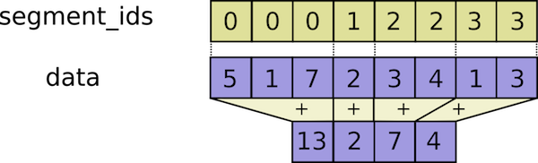
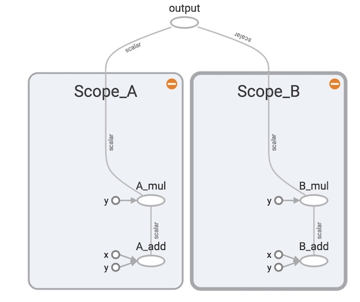

# 基本类型

Tensorflow以图（Graph）来表示计算任务，图中的节点称之为`op`（即operation）。每个节点包括0个或多个Tensor。为了进行计算，图必须在会话中启动，会话将图的`op`分发到CPU、GPU等设备并在执行后返回新的Tensor。

## 图（Graph）和会话（Session）

如果不指定图，tensorflow会自动创建一个，可以通过`tf.get_default_graph()`来获取这个默认图。

```sh
graph = tf.Graph()
with graph.as_default():
    value1 = tf.constant([1., 2.])
    value2 = tf.Variable([3., 4.])
    result = value1*value2
```

启动图时，需要创建会话，并在改会话中启动：

```python
# 使用自定义图
with tf.Session(graph=graph) as sess:
    tf.global_variables_initializer().run()
    print sess.run(result)
    print result.eval()
```

使用默认图

```python
sess = tf.Session()

# 在会话中执行图
print(sess.run(product))

# 使用完毕关闭会话
sess.close()
```

会话使用完成后必须关闭，可以调用`sess.close()`，也可以使用`with`代码块

```python
with tf.Session() as sess:
    print(sess.run(product))
```

会话在计算图时会自动检测设备，并在有GPU设备的机器上自动使用GPU。但多个GPU时，Tensorflow只会使用第一个GPU设备，要使用其他设备必须指定:

```python
with tf.Session() as sess:
    with tf.device("/gpu:1"):
        print(sess.run(product))
```

在IPython等交互式环境中，可以使用`tf.InteractiveSession`代替`tf.Session`。这样，可以直接调用`Tensor.eval()`和`Operation.run()`方法，非常方便。

## Tensor

Tensorflow中所有的数据都称之为Tensor，可以是一个变量、数组或者多维数组。Tensor有几个重要的属性:

- Rank：Tensor的纬数，比如
  - scalar rank=0
  - vector rank=1
  - matrix rank=2
- 类型：数据类型，比如
  - tf.float32
  - tf.uint8
- Shape：Tensor的形状，比如
  - vector shape=[D0]
  - matrix shape=[D0, D1]

Rank与Shape的关系如下表所示

Rank | Shape              | Dimension number | Example
---- | ------------------ | ---------------- | ---------------------------------------
0    | []                 | 0-D              | A 0-D tensor.  A scalar.
1    | [D0]               | 1-D              | A 1-D tensor with shape [5].
2    | [D0, D1]           | 2-D              | A 2-D tensor with shape [3, 4].
3    | [D0, D1, D2]       | 3-D              | A 3-D tensor with shape [1, 4, 3].
n    | [D0, D1, ... Dn-1] | n-D              | A tensor with shape [D0, D1, ... Dn-1].

## 常量（Constant）

常量即计算过程中不可变的类型，如

```python
a = tf.constant(2)
b = tf.constant(3)

with tf.Session() as sess:
    print sess.run(a+b)  # Output => 5
```

## 变量（Variable）

变量在计算过程中是可变的，并且在训练过程中会自动更新或优化，常用于模型参数。在定义时需要指定初始值。

如果只想在tf外手动更新变量，那需要声明变量是不可训练的，比如`not_trainable = tf.Variable(0, trainable=False)`。

```python
v1 = tf.Variable(10)
v2 = tf.Variable(5)

with tf.Session() as sess:
    # variables must be initialized first.
    tf.global_variables_initializer().run(session=sess)
    print(sess.run(v1+v2)) # Output => 15
```

## 占位符（Placeholder）

占位符用来给计算图提供输入，常用于传递训练样本。需要在`Session.run()`时通过feed绑定。

```python
a = tf.placeholder(tf.int16)
b = tf.placeholder(tf.int16)

# Define some operations
add = tf.add(a, b)
mul = tf.multiply(a, b)

with tf.Session() as sess:
    print (sess.run(add, feed_dict={a: 2, b: 3}))  # ==> 5
    print (sess.run(mul, feed_dict={a: 2, b: 3}))  # ==> 6
```

## 数据类型

Tensorflow有着丰富的数据类型，比如`tf.int32`, `tf.float64`等，这些类型跟numpy是一致的。

```python
import tensorflow as tf
import numpy as np

a = np.array([2, 3], dtype=np.int32)
b = np.array([4, 5], dtype=np.int32)
# Use `tf.add()` to initialize an "add" Operation
c = tf.add(a, b)

with tf.Session() as sess:
    print sess.run(c) # ==> [6 8]
```

`tf.convert_to_tensor(value, dtype=tf.float32)`是一个非常有用的转换函数，一般用来构造新的Operation。它还可以同时接受python原生类型、numpy数据以及Tensor数据。

## 数学计算

Tensorflow内置了很多的数学计算操作，包括常见的各种数值计算、矩阵运算以及优化算法等。

```python
import tensorflow as tf 
# 使用交互式会话方便展示
sess = tf.InteractiveSession()

x = tf.constant([[2, 5, 3, -5], 
                 [0, 3,-2,  5], 
                 [4, 3, 5,  3], 
                 [6, 1, 4,  0]]) 
y = tf.constant([[4, -7, 4, -3, 4], 
                 [6, 4,-7,  4, 7], 
                 [2, 3, 2,  1, 4], 
                 [1, 5, 5,  5, 2]])

floatx = tf.constant([[2., 5., 3., -5.], 
                      [0., 3.,-2.,  5.], 
                      [4., 3., 5.,  3.], 
                      [6., 1., 4.,  0.]]) 

print (tf.transpose(x).eval())
print (tf.matmul(x, y).eval())
print (tf.matrix_determinant(tf.to_float(x)).eval())
print (tf.matrix_inverse(tf.to_float(x)).eval())
print (tf.matrix_solve(tf.to_float(x), [[1],[1],[1],[1]]).eval())
```

### Reduction

Reduction对指定的维度进行操作，并返回降维后的结果：

```python
import tensorflow as tf
sess = tf.InteractiveSession()

x = tf.constant([[1,  2, 3], 
                 [3,  2, 1], 
                 [-1,-2,-3]])

boolean_tensor = tf.constant([[True,  False, True], 
                 [False, False, True], 
                 [True, False, False]])

print (tf.reduce_prod(x).eval()) # => -216
print (tf.reduce_prod(x, reduction_indices=1).eval()) # => [6,6,-6]
print (tf.reduce_min(x, reduction_indices=1).eval()) # => [ 1  1 -3]
print (tf.reduce_max(x, reduction_indices=1).eval()) # => [ 3  3 -1]
print (tf.reduce_mean(x, reduction_indices=1).eval()) # => [ 2  2 -2]

# Computes the "logical and" of elements
print (tf.reduce_all(boolean_tensor, reduction_indices=1).eval()) # => [False False False]

# Computes the "logical or" of elements
print (tf.reduce_any(boolean_tensor, reduction_indices=1).eval()) # => [ True  True  True]
```

### Segmentation

Segmentation根据指定的`segment_ids`对输入分段进行计算操作，并返回降维后的结果：



```python
import tensorflow as tf
sess = tf.InteractiveSession()

seg_ids = tf.constant([0,1,1,2,2]); # Group indexes : 0|1,2|3,4
x = tf.constant([[2, 5, 3, -5],
                    [0, 3,-2,  5], 
                    [4, 3, 5,  3], 
                    [6, 1, 4,  0],
                    [6, 1, 4,  0]])

print (tf.segment_sum(x, seg_ids).eval())
print (tf.segment_prod(x, seg_ids).eval())
print (tf.segment_min(x, seg_ids).eval())
print (tf.segment_max(x, seg_ids).eval())
print (tf.segment_mean(x, seg_ids).eval())
```

### Sequence

序列比较和索引提取操作。

```python
import tensorflow as tf 
sess = tf.InteractiveSession()

x = tf.constant([[2, 5, 3, -5], 
                 [0, 3,-2,  5], 
                 [4, 3, 5,  3], 
                 [6, 1, 4,  0]]) 
listx = tf.constant([1,2,5,3,4,5,6,7,8,3,2])
boolx = tf.constant([[True,False], [False,True]])

# 返回各列最小值的索引
print(tf.argmin(x, 0).eval()) # ==>  [1 3 1 0]

# 返回各行最大值的索引
print(tf.argmax(x, 1).eval()) # ==> [1 3 2 0]

# 返回Tensor为True的位置
# ==> [[0 0]
#      [1 1]]
print(tf.where(boolx).eval())

# 返回唯一化数据
print(tf.unique(listx)[0].eval()) # ==> [1 2 5 3 4 6 7 8]
```

## Name Scope

Name scopes可以把复杂操作分成小的命名块，方便组织复杂的图，并方便在TensorBoard展示。

```python
import tensorflow as tf

with tf.name_scope("Scope_A"):
    a = tf.add(1, 2, name="A_add")
    b = tf.multiply(a, 3, name="A_mul")

with tf.name_scope("Scope_B"):
    c = tf.add(4, 5, name="B_add")
    d = tf.multiply(c, 6, name="B_mul")

e = tf.add(b, d, name="output")
writer = tf.summary.FileWriter('./name_scope', graph=tf.get_default_graph())
writer.close()
```


