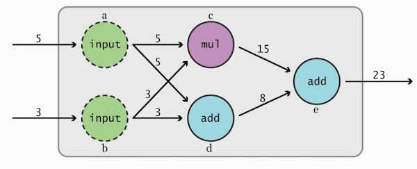
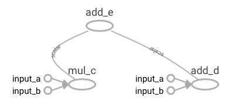

# Hello World

## 查看版本

引入tensorflow库并查看版本，确保已安装最新的稳定版（如1.2.0）。

```python
from __future__ import print_function, division
import tensorflow as tf

print('Loaded TF version', tf.__version__)
# Output: Loaded TF version 1.2.0
```

为了兼容Python2和Python3的`print`和`division`函数，建议每个使用到的文件都引入`from __future__ import print_function, division`。

## 简单示例

以一个简单的例子来看一下如何使用tensorflow



这个示例其实就是计算了`(5*3)+(5+3)`的结果

```sh
# 定义两个常量，值分别为5和3
a = tf.constant(5, name="input_a")
b = tf.constant(3, name="input_b")
# 定义运算操作
c = tf.multiply(a, b, name="mul_c")
d = tf.add(a, b, name="add_d")
e = tf.add(c, d, name="add_e")

# 创建会话，并开始运算
# 注意会话是必需的，会话开始前不会进行任何运算
with tf.Session() as sess:
    print(sess.run(e)) # Output => 23
    writer = tf.summary.FileWriter("./hello_graph", sess.graph)
    writer.flush()
    writer.close()
```

接着，可以启动tensorboard来查看这个Graph（在jupyter notebookt中可以执行`!tensorboard --logdir="hello_graph"`）：

```sh
tensorboard --logdir="hello_graph"
```

打开网页`http://localhost:6006`并切换到GRAPHS标签，可以看到生成的Graph：



## 输入数组示例

对于前面的示例，也可以使用数组作为输入

```python
import tensorflow as tf

a = tf.constant([5,3], name="input_a")
b = tf.reduce_prod(a, name="prod_b")
c = tf.reduce_sum(a, name="sum_c")
d = tf.add(c, b, name="add_d")

with tf.Session() as sess:
    print sess.run(d) # => 23
```

