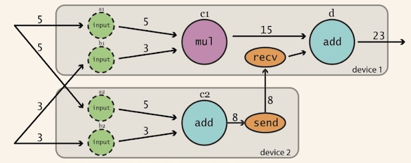

# Tensorflow简介

[Tensorflow](https://www.tensorflow.org)是一个使用数据流图 (data flow graphs) 技术来进行数值计算的开源软件库。

数据流图是是一个有向图，使用结点（一般用圆形或者方形描述，表示一个数学操作或者数据输入的起点和数据输出的终点）和线（表示数字、矩阵或者Tensor张量）来描述数学计算。数据流图可以方便的将各个节点分配到不同的计算设备上完成异步并行计算，适合大规模的机器学习应用。

