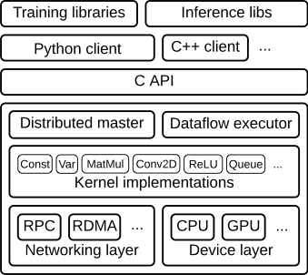
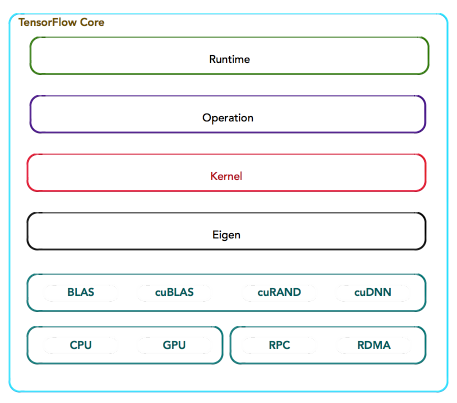
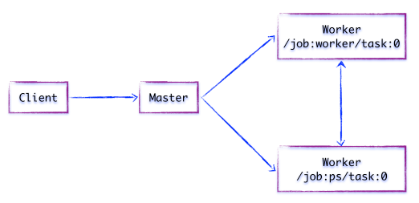

# Tensorflow简介

[Tensorflow](https://www.tensorflow.org)是一个使用数据流图 (data flow graphs) 技术来进行数值计算的开源软件库。

数据流图是是一个有向图，使用结点（一般用圆形或者方形描述，表示一个数学操作或者数据输入的起点和数据输出的终点）和线（表示数字、矩阵或者Tensor张量）来描述数学计算。数据流图可以方便的将各个节点分配到不同的计算设备上完成异步并行计算，适合大规模的机器学习应用。

Tensorflow支持多种异构平台，包括CPU、GPU、移动设备等。TensorFlow内核采用C/C++开发，并提供了C++，Python，Java，Go语言的Client API。其架构灵活，能够支持各种网络模型，具有良好的通用性和可扩展性。

## 系统概述

Tensorflow以`C API`为边界可以分为前端系统（提供编程模型，负责构造计算图）和后端系统（提供运行环境，负责执行计算图）：

如上图所示，系统中主要组件包括

- 支持多语言的客户端，方便用户构造各种复杂的计算图，实现所需的模型设计。客户端以Session为桥梁连接后段的运行时，并启动计算图的执行过程
- 分布式Master负责将计算图拆分为多个子图，以便在不通的进程和设备上并行执行
- Worker Service负责在硬件环境（如CPU或GPU）上调用OP的Kernel实现完成图的计算，并从其他Worker Service接受计算结果或将计算结果发送给其他Worker Services
- Kernel Implements是OP在硬件设备上的特定实现，负责执行OP运算，如数值计算、多维数组操作、控制流、状态管理等（如下图所示）

## 组件交互

假设存在两个任务

- `/job:ps/task:0`: 负责模型参数的存储和更新
- `/job:worker/task:0`: 负责模型的训练或推理

组件交互过程为

- 客户端通过TensorFlow的编程接口构造计算图
- 客户端建立Session会话，将Protobuf格式的图定义发送给Distributed Master
- Distributed Master根据`Session.run`的`Fetching`参数，从计算图中反向遍历，找到所依赖的最小子图；然后将该子图再次分裂为多个字图片段，以便在不同进程和设备上运行
- Distributed Master将这些子图片段分发给Work Service，并负责任务集的协同
- 随后Work Service启动「本地子图」的执行过程，包括
  - 处理来自Master的请求
  - 调度OP的Kernel实现，执行子图运算
  - 协同任务之间的数据通信

## 参考文档

- [TensorFlow Architecture](https://www.tensorflow.org/extend/architecture)
- [Tensorflow架构与设计](http://www.jianshu.com/p/a5574ebcdeab)
